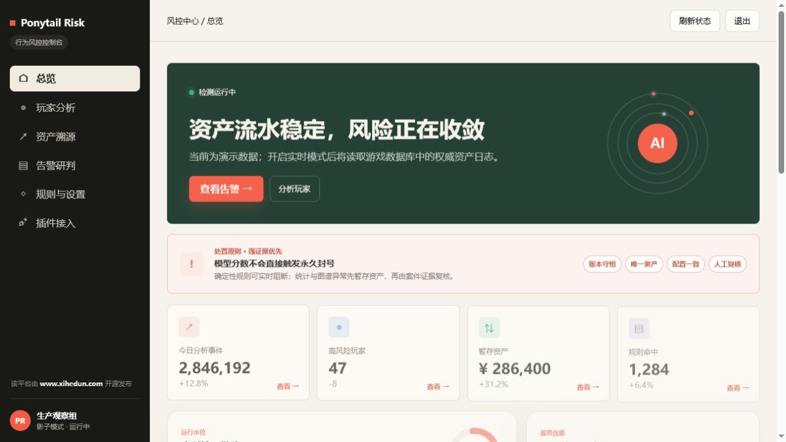
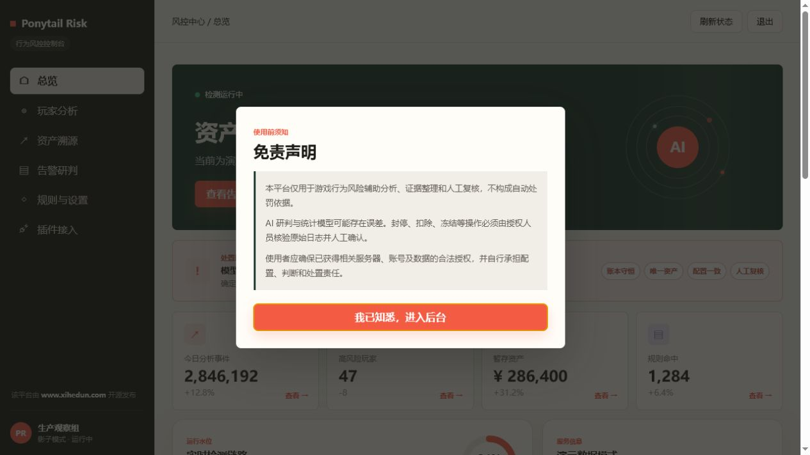
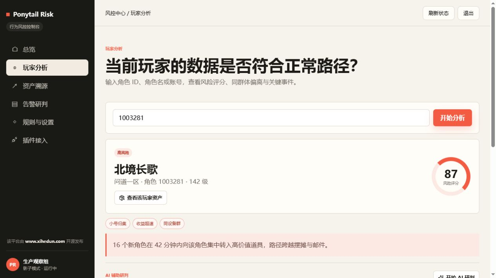
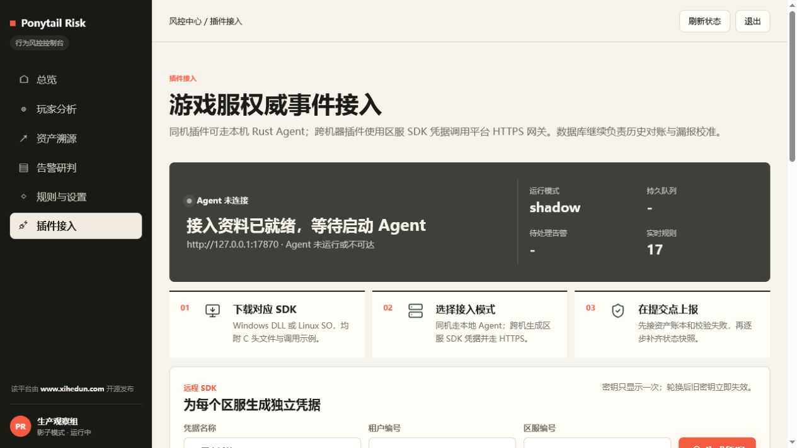
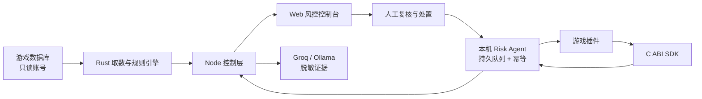

# Ponytail Risk

[](https://github.com/xihedun-2026/Ponytail-Risk-/actions/workflows/ci.yml)
[](LICENSE)
[](https://www.rust-lang.org/)
[](https://nodejs.org/)

面向私有游戏服务器的开源行为风控与证据复核平台。它把只读数据库分析、游戏插件实时事件、资产链路、规则评分和 AI 辅助研判放进同一个控制台，并明确保留人工处置边界。

项目由 [羲和盾](https://www.xihedun.com/) 开源发布，采用 [MIT License](LICENSE)。

> 当前内置数据适配器面向私有游戏服务器。其他游戏可以复用 `risk-agent`、C ABI SDK、事件合同和 Web 控制层，并实现自己的只读适配器。



## 界面预览

登录后必须确认使用边界，AI 与统计结果不会成为自动处罚依据：



玩家页将评分、规则标签、行为证据和 AI 辅助入口放在同一条复核链路中：



插件页提供本机 Agent、远程 SDK 凭据、C ABI 接口和事件合同：



## 核心能力

- **风险总览**：全服事件、风险玩家、暂存资产、规则命中和趋势聚合。
- **玩家分析**：币值、活跃、奖励、交易、设备关系和行为时间线联合评分。
- **资产溯源**：按 IID 回放生成、持有、转移、丢弃/拾取、商城和当前状态证据。
- **告警研判**：案件证据、人工观察/排除/升级，以及带幂等回执的处置命令队列。
- **实时 Agent**：本机接收权威插件事件，使用 SQLite/WAL 持久化、幂等去重、重试和死信。
- **C ABI SDK**：Windows DLL / Linux SO 五函数接口，便于现有 C/C++ 游戏插件接入。
- **AI 辅助**：支持 Groq 或本机 Ollama；玩家、账号、资产和持有人标识在发送前脱敏。
- **影子模式**：默认只分析和复核，不直接封号、扣款、冻结或修改游戏数据库。

## 工作方式



数据库链路用于历史回填、资产现状和漏报对账；插件链路在游戏逻辑的真实提交点产生权威事件。两条链路互补，不把页面文案或 AI 输出当成事实来源。

## 五分钟体验

默认启动的是演示数据，不需要数据库或 AI Key。

### Windows

双击 `一键启动.bat`，或在 PowerShell 中运行：

```powershell
powershell -ExecutionPolicy Bypass -File .\start-local.ps1
```

脚本会检查 Node.js、Rust 和 Windows C++ 构建工具；缺失时会明确提示并按需安装。只检查、不安装：

```powershell
powershell -ExecutionPolicy Bypass -File .\start-local.ps1 -NoInstall
```

### Linux / macOS

先安装 Node.js 18+ 和 Rust 1.88+，然后运行：

```bash
chmod +x start-local.sh
./start-local.sh
```

打开 [http://127.0.0.1:4173/](http://127.0.0.1:4173/)。未设置 `RISK_PORTAL_KEY` 时，本机演示卡密为 `PONYTAIL-DEMO-2026`；它只能用于本机体验，生产环境必须更换。

详细部署、实时数据库、Agent 与反向代理配置见 [部署指南](docs/DEPLOYMENT.md)。

## 手动启动

```bash
cargo build --release --locked
cp .env.example .env.local
# 编辑 .env.local，至少设置独立的 RISK_PORTAL_KEY 和 RISK_CONFIG_MASTER_KEY
node server.mjs
```

主要构建产物位于 `target/release/`：

| 产物 | 作用 |
|---|---|
| `risk-live-data` | 总览、玩家、资产、告警、采集与数据库连接测试 |
| `risk-probe` | 接服前只读检查库表结构、进程和端口 |
| `risk-agent` | 插件事件接收、持久队列、规则判断和可靠上送 |
| `risk_sdk.dll` / `librisk_sdk.so` | 游戏插件使用的 C ABI SDK |

`server.mjs` 按 `target/release/`、`target/debug/`、`PATH` 查找引擎，也可通过 `RISK_ENGINE` 指定路径。

## 接入真实数据

推荐顺序：

1. 使用只读数据库账号运行 `risk-probe`，确认目标库表与字段。
2. 开启 `GAME_DB_LIVE=1`，先在 shadow 模式观察并校准阈值。
3. 在币值、道具、奖励和交易的真实提交点接入 SDK 事件。
4. 对账数据库历史与插件实时事件，确认无丢失、重复或所有权断链。
5. 最后才启用人工处置命令拉取与回执。

插件字段、批量接口和埋点要求见 [游戏插件接入协议](docs/GAME_PLUGIN_INTEGRATION_V1.md)，JSON 合同见 [Schema](docs/plugin-event-batch.v1.schema.json)。平台不会直接写未知游戏数据库；处置动作必须由已授权游戏插件按 `action.id` 幂等执行并回传终态。

## AI 辅助研判

后台“规则与设置”可配置 Groq API 或本机 Ollama。AI 覆盖告警、玩家行为和资产链路三种研判，但只接收规则、分数、数值/布尔证据及哈希引用；角色名、账号、玩家 ID、资产 IID、持有人和字符串型原始证据不会发送到云端。

AI 结果不会直接触发封停、扣除或冻结。生产处置必须回到原始日志、账本和插件回执进行人工核验。

## 配置原则

- `.env.local`：本机环境变量，已被 Git 忽略。
- `data/`：加密连接配置、本地账本、AI 研判和命令状态，已被 Git 忽略。
- 数据库账号：只授予业务库所需的 `SELECT`。
- Portal：默认绑定 `127.0.0.1`；远程访问必须经 HTTPS 反向代理和来源限制。
- 密钥隔离：控制台卡密、配置主密钥、Agent Token、区服 SDK 密钥和 AI Key 不得复用。

完整变量表和生产部署示例见 [docs/DEPLOYMENT.md](docs/DEPLOYMENT.md)，威胁模型见 [docs/SECURITY_AND_LICENSING.md](docs/SECURITY_AND_LICENSING.md)。

## 验证

```bash
cargo fmt --all -- --check
cargo test --workspace --locked
node self_check.mjs
node engine_bridge_check.mjs
node plugin_contract_check.mjs
```

Windows 还可执行 C ABI 和 Agent HTTP 检查：

```powershell
powershell -NoProfile -ExecutionPolicy Bypass -File .\sdk_c_abi_check.ps1
powershell -NoProfile -ExecutionPolicy Bypass -File .\agent_http_check.ps1
```

`cargo test` 包含同一语料上的 Python/Rust 差分比对；Web 自检覆盖登录、会话、总览、玩家、资产、案件、设置、AI 脱敏和处置命令链。

## 项目结构

```text
crates/
  risk-core/       确定性评分、语义和格式化
  risk-ledger/     本地资产账本
  risk-agent/      插件实时事件与可靠队列
  risk-sdk/        C ABI SDK
  risk-adapter/    游戏数据库只读适配
  risk-engine/     数据引擎 CLI
  risk-probe/      接服前只读探针
public/            Web 控制台
deploy/            Linux 签名发布包与安装器
docs/              部署、安全和插件协议
tools/             差分基线与诊断工具
server.mjs         Node 控制层
```

## 安全与隐私

不要在 Issue、Pull Request 或截图中提交真实玩家数据、服务器地址、Cookie、API Key、数据库凭据、SDK 密钥或发布私钥。发现安全问题请按 [SECURITY.md](SECURITY.md) 私密报告。

本项目是风险分析和证据整理工具，不是自动处罚依据。使用者应确保已获得服务器、账号和数据的合法授权，并自行负责配置、判断和处置。

## 参与和许可证

贡献流程见 [CONTRIBUTING.md](CONTRIBUTING.md)，第三方组件说明见 [THIRD_PARTY_NOTICES.md](THIRD_PARTY_NOTICES.md)。

Ponytail Risk 以 [MIT License](LICENSE) 开源。
